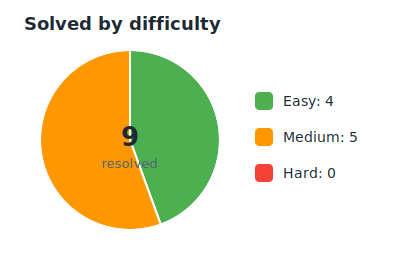
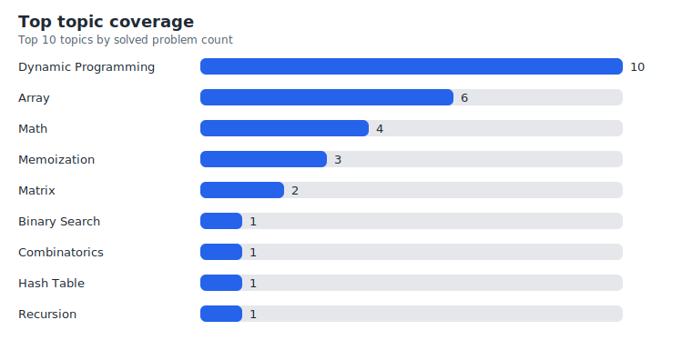

# LeedCode Solutions
This repository contains my solutions to various [LeetCode problems](https://leetcode.com/problemset/all/). I'm only doing leetcode for fun - no stress.

<!-- AUTO-GENERATED:LEETCODE_DASHBOARD_START -->
## Progress
Solved 9 problems. Easy: 4, Medium: 5, Hard: 0.

## Topics

| Topic | Solved |
| --- | ---: |
| [Dynamic Programming](https://leetcode.com/tag/dynamic-programming/) | 9 |
| [Array](https://leetcode.com/tag/array/) | 5 |
| [Math](https://leetcode.com/tag/math/) | 4 |
| [Memoization](https://leetcode.com/tag/memoization/) | 3 |
| [Binary Search](https://leetcode.com/tag/binary-search/) | 1 |
| [Combinatorics](https://leetcode.com/tag/combinatorics/) | 1 |
| [Hash Table](https://leetcode.com/tag/hash-table/) | 1 |
| [Matrix](https://leetcode.com/tag/matrix/) | 1 |
| [Recursion](https://leetcode.com/tag/recursion/) | 1 |
<!-- AUTO-GENERATED:LEETCODE_DASHBOARD_END -->

## Index
Total count: 9
- [62. Unique Paths](62_Unique_Paths.py) ([LeetCode](https://leetcode.com/problems/unique-paths/))
- [64. Minimum Path Sum](64_Minimum_Path_Sum.py) ([LeetCode](https://leetcode.com/problems/minimum-path-sum/))
- [70. Climbing Stairs](70_Climbing_Stairs.py) ([LeetCode](https://leetcode.com/problems/climbing-stairs/))
- [198. House Robber](198_House_Robber.py) ([LeetCode](https://leetcode.com/problems/house-robber/))
- [300. Longest Increasing Subsequence](300_Longest_Increasing_Subsequence.py) ([LeetCode](https://leetcode.com/problems/longest-increasing-subsequence/))
- [509. Fibonacci Number](509_Fibonacci_Number.py) ([LeetCode](https://leetcode.com/problems/fibonacci-number/))
- [740. Delete and Earn](740_Delete_and_Earn.py) ([LeetCode](https://leetcode.com/problems/delete-and-earn/))
- [746. Min Cost Climbing Stairs](746_Min_Cost_Climbing_Stairs.py) ([LeetCode](https://leetcode.com/problems/min-cost-climbing-stairs/))
- [1137. N-th Tribonacci Number](1137_Nth_Tribonacci_Number.py) ([LeetCode](https://leetcode.com/problems/n-th-tribonacci-number/))
