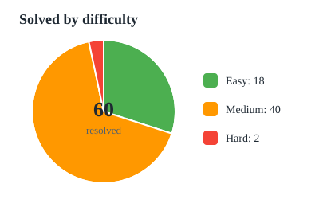
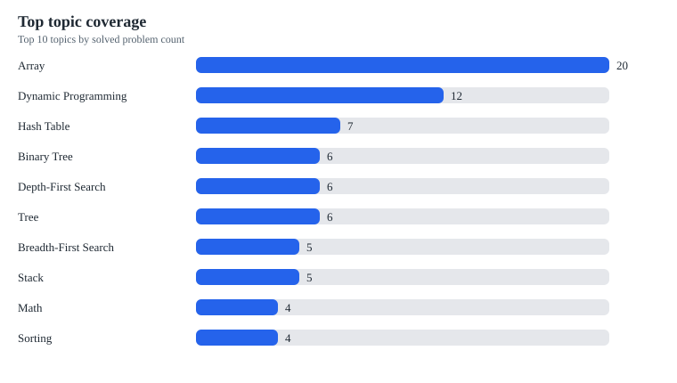

# LeedCode Solutions
This repository contains my solutions to various [LeetCode problems](https://leetcode.com/problemset/all/). I'm only doing leetcode for fun - no stress.

Non-LeetCode algorithm notes and examples live in [learning_examples](learning_examples/).

<!-- AUTO-GENERATED:LEETCODE_DASHBOARD_START -->
## Progress
Solved 37 problems. Easy: 14, Medium: 22, Hard: 1.

## Topics

| Topic | Solved |
| --- | ---: |
| [Array](https://leetcode.com/tag/array/) | 21 |
| [Dynamic Programming](https://leetcode.com/tag/dynamic-programming/) | 12 |
| [Breadth-First Search](https://leetcode.com/tag/breadth-first-search/) | 8 |
| [Depth-First Search](https://leetcode.com/tag/depth-first-search/) | 8 |
| [Hash Table](https://leetcode.com/tag/hash-table/) | 8 |
| [Binary Tree](https://leetcode.com/tag/binary-tree/) | 6 |
| [Tree](https://leetcode.com/tag/tree/) | 6 |
| [Stack](https://leetcode.com/tag/stack/) | 5 |
| [Math](https://leetcode.com/tag/math/) | 4 |
| [Matrix](https://leetcode.com/tag/matrix/) | 4 |
| [Sorting](https://leetcode.com/tag/sorting/) | 4 |
| [String](https://leetcode.com/tag/string/) | 4 |
| [Two Pointers](https://leetcode.com/tag/two-pointers/) | 4 |
| [Memoization](https://leetcode.com/tag/memoization/) | 3 |
| [Monotonic Stack](https://leetcode.com/tag/monotonic-stack/) | 3 |
| [Binary Search](https://leetcode.com/tag/binary-search/) | 2 |
| [Graph Theory](https://leetcode.com/tag/graph/) | 2 |
| [Union-Find](https://leetcode.com/tag/union-find/) | 2 |
| [Binary Lifting](https://leetcode.com/tag/binary-lifting/) | 1 |
| [Binary Search Tree](https://leetcode.com/tag/binary-search-tree/) | 1 |
| [Bracket Sequences](https://leetcode.com/tag/bracket-sequences/) | 1 |
| [Combinatorics](https://leetcode.com/tag/combinatorics/) | 1 |
| [Design](https://leetcode.com/tag/design/) | 1 |
| [Directed Acyclic Graph](https://leetcode.com/tag/directed-acyclic-graph/) | 1 |
| [Divide and Conquer](https://leetcode.com/tag/divide-and-conquer/) | 1 |
| [Greedy](https://leetcode.com/tag/greedy/) | 1 |
| [Longest Increasing Subsequence](https://leetcode.com/tag/longest-increasing-subsequence/) | 1 |
| [Lowest Common Ancestor](https://leetcode.com/tag/lowest-common-ancestor/) | 1 |
| [Prefix Sum](https://leetcode.com/tag/prefix-sum/) | 1 |
| [Range Minimum/Maximum Query](https://leetcode.com/tag/range-minimum-maximum-query/) | 1 |
| [Recursion](https://leetcode.com/tag/recursion/) | 1 |
| [Topological Sort](https://leetcode.com/tag/topological-sort/) | 1 |
<!-- AUTO-GENERATED:LEETCODE_DASHBOARD_END -->

## Index
Total count: 37
- [1. Two Sum](1_Two_Sum.py) ([LeetCode](https://leetcode.com/problems/two-sum/))
- [11. Container With Most Water](11_Container_with_Most_Water.py) ([LeetCode](https://leetcode.com/problems/container-with-most-water/))
- [15. 3Sum](15_3Sum.py) ([LeetCode](https://leetcode.com/problems/3sum/))
- [20. Valid Parentheses](20_Valid_Parentheses.py) ([LeetCode](https://leetcode.com/problems/valid-parentheses/))
- [49. Group Anagrams](49_Group_Anagrams.py) ([LeetCode](https://leetcode.com/problems/group-anagrams/))
- [53. Maximum Subarray](53_Maximum_Subarray.py) ([LeetCode](https://leetcode.com/problems/maximum-subarray/))
- [62. Unique Paths](62_Unique_Paths.py) ([LeetCode](https://leetcode.com/problems/unique-paths/))
- [63. Unique Paths II](63_Unique_Paths_II.py) ([LeetCode](https://leetcode.com/problems/unique-paths-ii/))
- [64. Minimum Path Sum](64_Minimum_Path_Sum.py) ([LeetCode](https://leetcode.com/problems/minimum-path-sum/))
- [70. Climbing Stairs](70_Climbing_Stairs.py) ([LeetCode](https://leetcode.com/problems/climbing-stairs/))
- [84. Largest Rectangle in Histogram](84_Largest_Rectangle_in_Hostogram.py) ([LeetCode](https://leetcode.com/problems/largest-rectangle-in-histogram/))
- [98. Validate Binary Search Tree](98_Validate_Binary_Search_Tree.py) ([LeetCode](https://leetcode.com/problems/validate-binary-search-tree/))
- [100. Same Tree](100_Same_Tree.py) ([LeetCode](https://leetcode.com/problems/same-tree/))
- [102. Binary Tree Level Order Traversal](102_Binary_Tree_Level_Order_Traversal.py) ([LeetCode](https://leetcode.com/problems/binary-tree-level-order-traversal/))
- [104. Maximum Depth of Binary Tree](104_Maximum_Depth_of_Binary_Tree.py) ([LeetCode](https://leetcode.com/problems/maximum-depth-of-binary-tree/))
- [121. Best Time to Buy and Sell Stock](121_Best_Time_to_Buy_and_Sell_Stock.py) ([LeetCode](https://leetcode.com/problems/best-time-to-buy-and-sell-stock/))
- [125. Valid Palindrome](125_Valid_Palindrome.py) ([LeetCode](https://leetcode.com/problems/valid-palindrome/))
- [128. Longest Consecutive Sequence](128_Longest_Consecutive_Sequence.py) ([LeetCode](https://leetcode.com/problems/longest-consecutive-sequence/))
- [133. Clone Graph](133_Clone_Graph.py) ([LeetCode](https://leetcode.com/problems/clone-graph/))
- [155. Min Stack](155_Min_Stack.py) ([LeetCode](https://leetcode.com/problems/min-stack/))
- [167. Two Sum II - Input Array Is Sorted](167_Two_Sum_II_Input_Array_Is_Sorted.py) ([LeetCode](https://leetcode.com/problems/two-sum-ii-input-array-is-sorted/))
- [198. House Robber](198_House_Robber.py) ([LeetCode](https://leetcode.com/problems/house-robber/))
- [200. Number of Islands](200_Number_of_Islands.py) ([LeetCode](https://leetcode.com/problems/number-of-islands/))
- [207. Course Schedule](207_Course_Schedule.py) ([LeetCode](https://leetcode.com/problems/course-schedule/))
- [217. Contains Duplicate](217_Contains_Duplicate.py) ([LeetCode](https://leetcode.com/problems/contains-duplicate/))
- [226. Invert Binary Tree](226_Invert_Binary_Tree.py) ([LeetCode](https://leetcode.com/problems/invert-binary-tree/))
- [236. Lowest Common Ancestor of a Binary Tree](236_Lowest_Common_Ancestor_of_a_Binary_Tree.py) ([LeetCode](https://leetcode.com/problems/lowest-common-ancestor-of-a-binary-tree/))
- [238. Product of Array Except Self](238_Product_of_Array_Except_Self.py) ([LeetCode](https://leetcode.com/problems/product-of-array-except-self/))
- [242. Valid Anagram](242_Valid_Anagram.py) ([LeetCode](https://leetcode.com/problems/valid-anagram/))
- [300. Longest Increasing Subsequence](300_Longest_Increasing_Subsequence.py) ([LeetCode](https://leetcode.com/problems/longest-increasing-subsequence/))
- [496. Next Greater Element I](496_Next_Greater_Element_I.py) ([LeetCode](https://leetcode.com/problems/next-greater-element-i/))
- [509. Fibonacci Number](509_Fibonacci_Number.py) ([LeetCode](https://leetcode.com/problems/fibonacci-number/))
- [739. Daily Temperatures](739_Daily_Temperatures.py) ([LeetCode](https://leetcode.com/problems/daily-temperatures/))
- [740. Delete and Earn](740_Delete_and_Earn.py) ([LeetCode](https://leetcode.com/problems/delete-and-earn/))
- [746. Min Cost Climbing Stairs](746_Min_Cost_Climbing_Stairs.py) ([LeetCode](https://leetcode.com/problems/min-cost-climbing-stairs/))
- [994. Rotting Oranges](994_Rotting_Oranges.py) ([LeetCode](https://leetcode.com/problems/rotting-oranges/))
- [1137. N-th Tribonacci Number](1137_Nth_Tribonacci_Number.py) ([LeetCode](https://leetcode.com/problems/n-th-tribonacci-number/))
